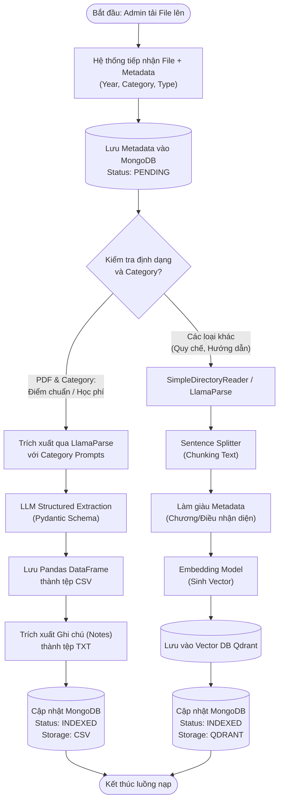
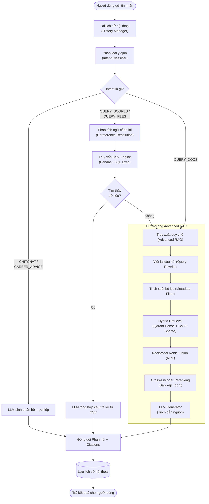

# BÁO CÁO KỸ THUẬT: HIỆN THỰC LUỒNG NẠP VÀ TRUY XUẤT DỮ LIỆU

Báo cáo này mô tả chi tiết kiến trúc luồng dữ liệu (Data Flow) của hệ thống RAG Chatbot tư vấn tuyển sinh ĐH An Giang. Hệ thống được chia thành hai luồng chính: **Luồng nạp dữ liệu (Data Ingestion)** và **Luồng truy xuất - phản hồi (Data Retrieval & Response)**.

---

## 1. Luồng Nạp Dữ Liệu (Data Ingestion Flow)

Luồng nạp dữ liệu có nhiệm vụ tiếp nhận các tệp văn bản từ phòng Tuyển sinh (Quy chế, Thông báo điểm chuẩn, Học phí), bóc tách và phân loại chúng vào các kho lưu trữ phù hợp (Vector Database hoặc Structured CSV). Điểm nổi bật của luồng này là khả năng phân nhánh xử lý thông minh dựa trên định dạng tệp và loại danh mục nội dung (Category).

### 1.1 Sơ đồ hoạt động (Activity Diagram)

### 1.2 Diễn giải chi tiết
1. **Tiếp nhận & Tracking:** Mọi tài liệu khi đưa vào hệ thống đều được cấp 1 `doc_uuid` và kiểm soát trạng thái trên MongoDB.
2. **Branching 1 (Structured Data):** Nếu tài liệu là Thông báo Điểm chuẩn hoặc Học phí, LlamaParse áp dụng Prompt gắt gao để giữ cấu trúc bảng. LLM Pydantic bóc tách và dóng lại thành cấu trúc dẹt (Flat CSV) để giảm thiểu ảo giác (Hallucination) khi truy vấn các con số.
3. **Branching 2 (Unstructured Data):** Các quy chế văn bản được chia nhỏ (Chunking) theo đoạn (SentenceSplitter), đính kèm ngữ cảnh (Chương, Điều) để tránh việc đoạn văn bị mồ côi (Lost context), sau đó vector hóa đưa vào hạ tầng Qdrant.

---

## 2. Luồng Truy Xuất và Phản Hồi (Data Retrieval & Response Flow)

Luồng này là trái tim của hệ thống Chatbot trong quá trình tương tác (Inference). Nó kết hợp định tuyến ý định (Intent Routing), Truy vấn dữ liệu dạng bảng (Pandas Query), và truy xuất văn bản kết hợp lai (Advanced RAG - Hybrid Search & Reranking).

### 2.1 Sơ đồ hoạt động (Activity Diagram)

### 2.2 Diễn giải chi tiết
1. **Coreference Resolution:** Trọn vẹn các câu hỏi khuyết chủ ngữ/đối tượng (VD: "Điểm ngành này năm ngoái bao nhiêu?") đều được LLM tham chiếu lại Lịch sử hội thoại (History Manager) để dịch ra câu hỏi tường minh trước khi truy vấn.
2. **CSV Routing (Deterministic Logic):** Các ý định liên quan đến con số cứng xác thực như điểm chuẩn và học phí ưu tiên đi qua nhánh nội suy CSV (Pandas Query Engine). Phương pháp này đảm bảo tính chính xác 100% về mặt toán học so với việc phán đoán Text.
3. **Đường ống Advanced RAG (Quy chế):** Nếu không đi qua nhánh CSV hoặc nhánh CSV không tìm thấy, hệ thống quay về RAG Quy chế:
   - **Query Rewrite & Filtering:** Tách các thực thể năm (Year), danh mục (Category) làm hard-filters đưa xuống cơ sở dữ liệu.
   - **Mảnh ghép Hybrid + Reranker:** Dense vector bắt ngữ nghĩa, BM25 bắt từ khóa. Cả hai rổ kết quả được hợp nhất bằng RRF (Top 10), trước khi mô hình Cross-Encoder xem xét kĩ lưỡng lần hai để chắt lọc Top 5 đoạn văn ngữ cảnh quý giá nhất đưa vào Prompt.
4. **Citability (Có trích dẫn):** Mọi phản hồi đều buộc kèm theo danh sách các tài liệu (Nguồn, điều số), cho phép người dùng đối chứng.
